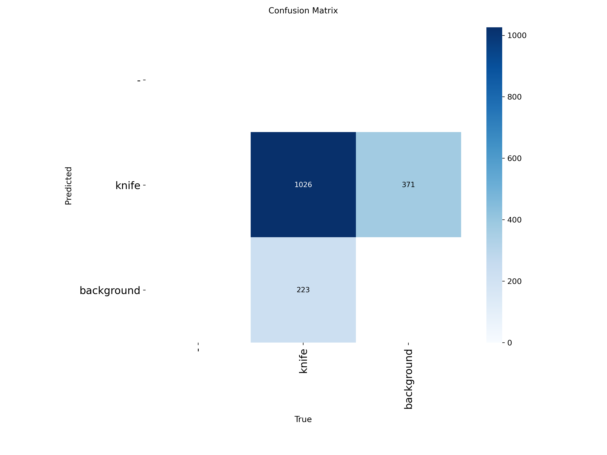
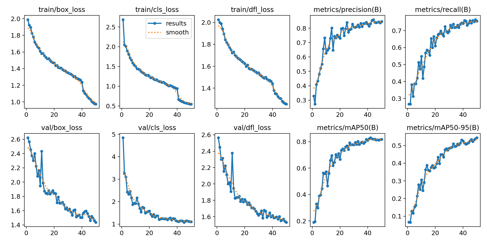
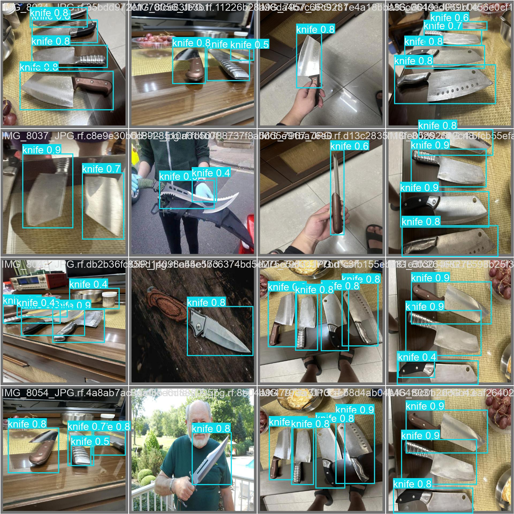

# Sistema de Detecção de Armas Brancas em Tempo Real (YOLOv11)

[](https://github.com/ultralytics/ultralytics)
[](https://www.python.org/)
[](https://colab.research.google.com/drive/1xGWFL3cmzjnKYP_IzG9nzp9rc2z5PaZ4?usp=sharing)

**Status:** Versão 1.0 (Estável)

## Visão Geral

Este projeto apresenta um sistema de visão computacional para detecção de armas brancas (facas) em tempo real a partir de vídeo. Utilizando a arquitetura YOLOv11s (Small, versão customizada), o sistema processa frames capturados via webcam diretamente no navegador (Google Colab), aplicando um pipeline de pós-processamento para padronização de alertas.

O foco do projeto foi criar uma solução **Cloud-Native** que permite inferência acelerada por GPU (Tesla T4) sem necessidade de instalação local complexa, utilizando uma ponte JavaScript-Python para captura de vídeo.

### Destaques Técnicos
* **Filtragem de Ruído:** Definição de limiar de confiança (`conf > 0.40`) ajustado empiricamente para eliminar falsos positivos comuns em ambientes domésticos.
* **Inferência Híbrida:** Pipeline customizado que integra o kernel Python do Colab com a API de mídia do navegador, permitindo processamento de vídeo em tempo real na nuvem.

---

## Demonstração
<div align="center">
  
</div>
<br>

---
## Resultados e Métricas
Desempenho do modelo durante a fase de validação:

### 1. Matriz de Confusão
Visualização dos acertos e erros do modelo por classe.


### 2. Curvas de Aprendizado
Evolução da perda (loss) e precisão (mAP) durante as épocas de treino.


### 3. Validação Visual (Batch de Teste)
Exemplos de detecções realizadas no conjunto de validação.


---
## Especificações Técnicas
* **Modelo:** YOLOv11s (Fine-Tuning com pesos `best.pt`).
* **Hardware:** NVIDIA Tesla T4 (16GB VRAM).
* **Stack:**
    * `ultralytics`: Motor de inferência YOLO.
    * `opencv-python`: Manipulação de arrays de imagem.
    * `IPython.display` & `JavaScript`: Interface de captura de vídeo web.

---

## Instruções de Execução (Google Colab)

Este projeto foi desenhado para ser executado inteiramente na nuvem.

1. **Acesso:** Clique no botão **"Open in Colab"** no topo deste documento.
2. **Setup:**
    * Certifique-se de que o arquivo de pesos `best.pt` foi carregado na raiz do ambiente ou na pasta correta.
    * No menu do Colab, verifique se o **Ambiente de Execução** está configurado para **GPU**.
3. **Execução:**
    * Rode as células de instalação de dependências.
    * Execute a célula **"Webcam Stream"**.
    * O navegador solicitará permissão para usar sua câmera.

---

## Estrutura do Repositório
```text
├── models/
│   └── best.pt               # Pesos do modelo treinado
├── notebooks/
│   ├── 1_training_pipeline.ipynb   # Pipeline de treinamento e validação
│   └── 2_inference_webcam.ipynb    # Script de inferência via Webcam (Colab)
├── assets/
│   ├── demo_preview.gif      # Demonstração do funcionamento
│   ├── confusion_matrix.png  # Métricas de confusão
│   ├── results.jpg           # Curvas de aprendizado
│   └── val_batch0_pred.jpg   # Validação visual
└── README.md                 # Documentação do projeto

```

## Autor
Desenvolvido por **Thiago Gabriel Da Silva Oliveira**.

Projeto de portfólio focado em Engenharia de Dados e Visão Computacional.

[](https://www.linkedin.com/in/thigab)


